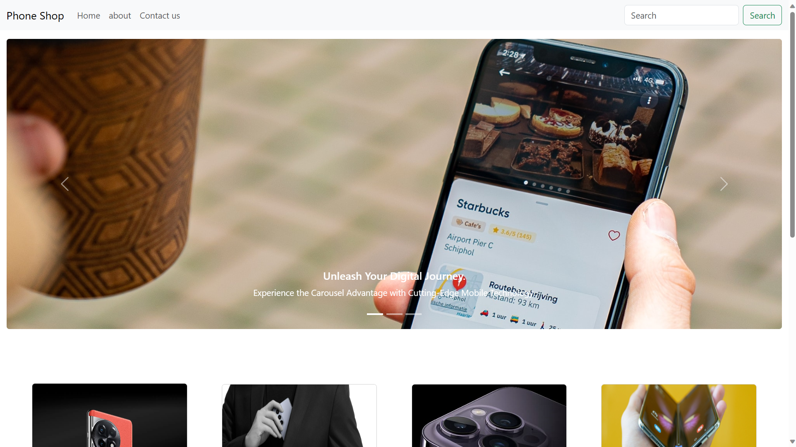

# Phone Shop Django Project

![Phone Shop]


## Overview

Phone Shop is a feature-rich Django web application that serves as a basic e-commerce platform for understanding Django concepts. It allows users to fill out a form, and the submitted information is accessible in the Django admin page. The project incorporates HTML, CSS, Bootstrap, Python, and Django.

## Features

- **User-friendly Form:**
  - Seamless form for users to submit information.
  - Real-time validation for a smooth user experience.

- **Django Admin Integration:**
  - View and manage user-submitted data through the Django admin interface.
  - Customized admin page for a more user-friendly admin experience.

- **Responsive Design:**
  - Utilizes Bootstrap for a responsive and mobile-friendly design.
  - Ensures a consistent experience across various devices.

- **Search Functionality:**
  - Search functionality implemented for efficiently finding user data.
  - Filters and sorting options for enhanced data management.

- **Custom Styling:**
  - Unique and visually appealing styling with custom CSS.
  - Integration of Bootstrap components for a modern look and feel.

## Technologies Used

- **Frontend:**
  - HTML
  - CSS
  - Bootstrap

- **Backend:**
  - Python
  - Django

## Setup

1. Clone the repository:

    ```bash
    git clone https://github.com/your-username/phone-shop.git
    ```

2. Install the dependencies:

    ```bash
    pip install -r requirements.txt
    ```

3. Apply migrations:

    ```bash
    python manage.py migrate
    ```

4. Run the development server:

    ```bash
    python manage.py runserver
    ```

## Usage

1. Visit [http://localhost:8000/](http://localhost:8000/) in your web browser.
2. Explore the Phone Shop website.
3. Fill out the form to submit data.
4. Access the Django admin page at [http://localhost:8000/admin/](http://localhost:8000/admin/) to view and manage submitted information.

## Screenshots


## Contributing

Contributions are welcome! Fork the project, create a branch, and submit a pull request.

## License

This project is open source and available under the [MIT License](LICENSE). Feel free to use, modify, and distribute the code for your own projects. If you make any improvements, contributions, or bug fixes, consider sharing them by creating a pull request.

## Contact

- Your Name
- Email: your.email@example.com
- LinkedIn: [Your LinkedIn Profile](https://www.linkedin.com/in/your-profile/)
